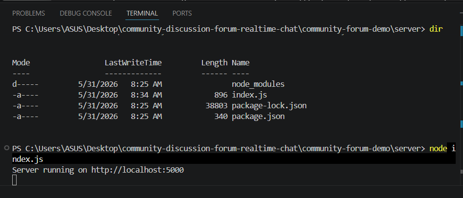
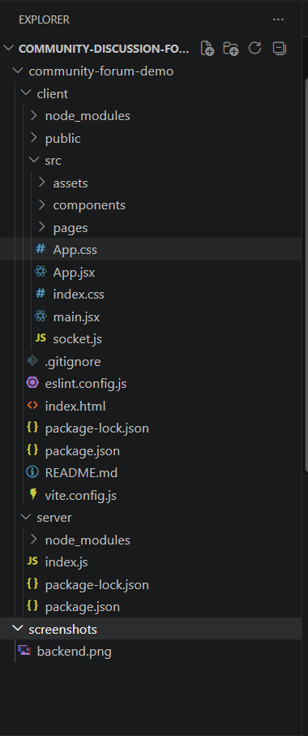

# 💬 Community Discussion Forum with Real-Time Chat

## 📌 Project Overview
This is a full-stack real-time chat application built using **Node.js, Express, Socket.IO, and React (Vite)**.  
It allows users to send and receive messages instantly without refreshing the page.

---

## 🚀 Features
- ⚡ Real-time messaging using Socket.IO
- 💬 Live chat updates across multiple tabs
- 🧠 Simple and clean UI
- 📡 Backend with Express server
- 🔗 Frontend built with React + Vite

---

## 🛠️ Tech Stack
- Frontend: React (Vite)
- Backend: Node.js, Express
- Real-time: Socket.IO
- Styling: Inline CSS

---

## 📁 Folder Structure

server/
client/
screenshots/


---

## ⚙️ How to Run Project

### 1. Start Backend
```bash
cd server
node index.js
2. Start Frontend
cd client
npm install
npm run dev
🌐 Application URL
Frontend: http://localhost:5173
Backend: http://localhost:5000
📸 Screenshots

🟢 Backend screenshot

🟢 Folder structure screenshot


🎯 Learning Outcomes
Learned real-time communication using Socket.IO
Built full-stack MERN-style architecture
Understood client-server WebSocket flow
Improved frontend-backend integration skills
👨‍💻 Author

Student Project — Full Stack Development Practic
